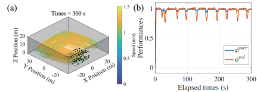
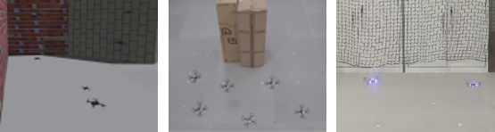
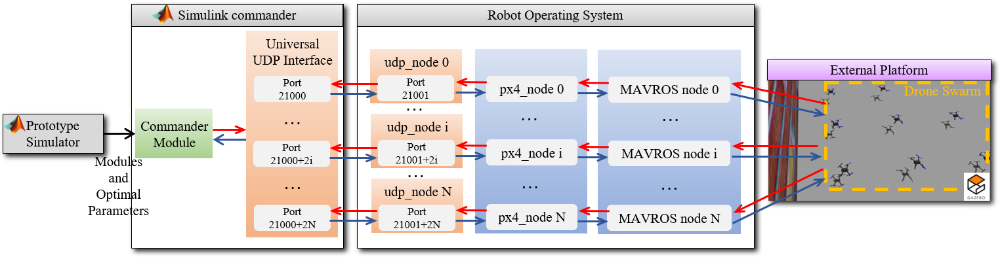

# CoFlyers
CoFlyers: a universal platform for collective flying of swarm drones

IROS2023

<p align="center">

</p>

## 目录
<!-- @import "[TOC]" {cmd="toc" depthFrom=2 depthTo=6 orderedList=false} -->

<!-- code_chunk_output -->

- [CoFlyers](#coflyers)
  - [目录](#目录)
  - [介绍](#介绍)
  - [依赖](#依赖)
  - [安装](#安装)
  - [概述](#概述)
    - [原型仿真器](#原型仿真器)
    - [用于绘图的图形用户界面](#用于绘图的图形用户界面)
    - [用于仿真的图形用户界面](#用于仿真的图形用户界面)
    - [无人机集群验证系统](#无人机集群验证系统)
  - [一个分步示例](#一个分步示例)
    - [集群算法与性能指标](#集群算法与性能指标)
    - [对集群算法进行快速原型](#对集群算法进行快速原型)
    - [对集群算法进行自动调参](#对集群算法进行自动调参)
    - [对集群算法进行批处理分析](#对集群算法进行批处理分析)
    - [对集群算法进行高保真仿真](#对集群算法进行高保真仿真)
    - [对集群算法进行Tello\&OptiTrack下的实物实验验证](#对集群算法进行tellooptitrack下的实物实验验证)
    - [对集群算法进行Crazyswarm\&OptiTrack下的实物实验验证](#对集群算法进行crazyswarmoptitrack下的实物实验验证)
    - [对集群算法进行虚实结合验证](#对集群算法进行虚实结合验证)
  - [故障排除](#故障排除)

<!-- /code_chunk_output -->

## 介绍

*CoFlyers* 是一个面向无人机集群协同的测评验证平台，仅要求用户具备MATLAB&Simulink的编程能力，提供快速原型、自动调参、批处理、高保真仿真、实物实验验证以及虚实结合验证六大功能。

* 快速原型

<p align="center">

</p>

<p align="center" style="color: #999;">
采用Vásárhelyi算法在受限环境下的集群运动
</p>

<br>


<p align="center">

</p>
<p align="center" style="color: #999;">
仿真环境和激光雷达
</p>
<br>

* 为获得优化后的参数的自动调参
<p align="center">

</p>
<p align="center" style="color: #999;">
Parameter auto-tuning of the Vásárhelyi algorithm
</p>


* 为获得大量内外部参数对集群性能影响的批处理
<p align="center">

</p>
<p align="center" style="color: #999;">
控制采样时间和速度噪声对采用Vásárhelyi算法的集群性能的影响
</p>


<br>


* ROS&PX4&Gazebo下的高保真仿真
* Tello&OptiTrack下的实物实验验证
* Crazyswarm&OptiTrack下的实物实验验证
<p align="center">

</p>
<p align="center" style="color: #999;">
高保真仿真与实物实验验证
</p>

* 虚实结合验证
<p align="center">

</p>

## 依赖

* 对于原型仿真器、Simulink指挥站的使用，仅需要安装[MATLAB R2021b及以上](https://www.mathworks.com/support/install-matlab.html?q=&page=1)。（支持Windows和Ubuntu系统）
* 对于高保真仿真的使用，需要安装[PX4](https://github.com/PX4/PX4-Autopilot)和[Gazebo](https://gazebosim.org/home)。 (支持Ubuntu18.04系统)
* 对于Tello&OptiTrack下的实物实验验证的使用，需要Windows系统，无需其他依赖。
* 对于Crazyswarm&OptiTrack下的实物实验验证的使用，需要安装[crazyswarm](https://github.com/USC-ACTLab/crazyswarm).（支持Ubuntu18.04系统）


## 安装
1. 克隆*CoFlyers*的git项目或直接下载该项目:
<pre><code>git clone https://github.com/micros-uav/CoFlyers.git</code></pre>

2. 对于PX4下的仿真, 复制一些文件到PX4项目的对应路径
<pre><code>sudo cp ./CoFlyers/for_external_projects/PX4-Autopilot/my_world.world ./PX4-Autopilot/Tools/sitl_gazebo/worlds
sudo cp ./CoFlyers/for_external_projects/PX4-Autopilot/multi_uav_mavros_sitl_1.launch ./PX4-Autopilot/launch
sudo cp ./CoFlyers/for_external_projects/PX4-Autopilot/multi_uav_mavros_sitl_10.launch ./PX4-Autopilot/launch</code></pre>

3. 对于Crazyswarm下的实验，复制一些文件到Crazyswarm项目的对应路径
<pre><code>sudo cp -r ./CoFlyers/for_external_projects/crazyswarm/crazyswarm_coflyers ./crazyswarm/ros_ws/src
cd ./crazyswarm/ros_ws
catkin_make</code></pre>
目前，Crazyswarm创建的/cf#/pose话题的发布频率存在问题。它不能在30Hz或更快的频率下执行。如果用户的Crazywarm项目可以正常地以30Hz的频率向/cf#/pose话题发布位姿，则无需用以下命令替换源代码：
<pre><code>sudo cp ./CoFlyers/for_external_projects/crazyswarm/crazyswarm_server.cpp ./crazyswarm/ros_ws/src/crazyswarm/src
cd ./crazyswarm/ros_ws
catkin_make</code></pre>
编译:
<pre><code>cd ./crazyswarm/ros_ws
catkin_make</code></pre>

## 概述

<!-- <p align="center">

</p>
<p align="center" style="color: #999;">
Overall architecture of the platform
</p> -->

<p align="center">

</p>
<p align="center" style="color: #999;">
CoFlyers平台的总体框架
</p>

<br>

*CoFlyers*平台总体上具有四个组件，分别是原型仿真器、无人机集群验证系统以及两个分别用于绘图和用于仿真的图形用户界面（GUI）。原型仿真器提供快速原型、自动调参、批处理功能。无人机集群验证系统提供高保真仿真、实物实验验证以及虚实结合验证功能。用于绘图的图形用户界面允许用户交互式地编辑三维仿真障碍环境。而用于仿真的图形用户界面允许用户交互式地操作原型仿真器，手动调节参数并观察仿真结果。原型仿真器和两个GUI完全基于MATLAB语言进行开发，而无人机集群验证系统依靠Simulink集成在MATLAB中的特性能够直接继承原型仿真器的特性，无需在使用进阶功能时重复进行编程。


### 原型仿真器

<br>

<!-- <p align="center">

</p>
<p align="center" style="color: #999;">
Architecture of prototype simulator
</p> -->
<p align="center">

</p>
<p align="center" style="color: #999;">
原型仿真器的框架
</p>

<br>

原型仿真器采用分层模块化的思想进行设计，其模块和层级如上图所示，其中集群模块和评估模块是用户需主要关注和编写的模块，分别用于部署集群算法和集群性能评估指标。

原型仿真器的模块参数都在一个XML格式的参数配置文件中进行配置，后处理程序会根据该配置文件自动生成定义参数的MATLAB脚本函数，以供各模块其他函数使用。另外，对于集群模块和评估模块，在用户在配置文件中添加子模块之后，后处理程序会自动产生具有标准输入输出的MATLAB函数，用于部署用户的算法、性能评估指标的相关代码。

<!-- #### Map module

<p align="center">

</p>

<p align="center" style="color: #999;">
3D map define
</p>

<br> -->

### 用于绘图的图形用户界面

<br>

<p align="center">

</p>
<p align="center" style="color: #999;">
用于绘制三维仿真障碍环境的图形用户界面
</p>

<br>

用于绘图的图形用户界面用于提供给用户一个能够交互式、可视化地配置三维仿真障碍环境的工具。

### 用于仿真的图形用户界面

<br>

<p align="center">


</p>
<p align="center" style="color: #999;">
用于仿真的图形用户界面（左：PSO算法效果，右：Vásárhelyi算法效果）
</p>

<br>

用于绘图的图形用户界面用于提供给用户一个能够交互式、可视化地调试算法参数并观察结果的工具。

### 无人机集群验证系统

无人机集群验证系统总体上包括三个组件：集群指挥站、通信转发模块以及外部系统。集群指挥站在Simulink环境中进行开发，直接继承原型仿真器的模块。它接收来自外部的所有无人机的位姿，并向外发送对所有无人机的上层控制指令。集群指挥站与其他组件的连接采用UDP通信，并采用标准化的通信协议，对于每架无人机都设置了一个端口用于接收对应无人机的位姿并发送上层指令。故不管什么类型的外部系统，只要以标准化的通信协议定义通信端口和数据，都可以与集群指挥站进行通信。因此，本平台的集群指挥站能够与多种不同的外部系统进行连接，甚至可以同时与多种外部系统连接进行算法的验证。而由于外部系统通常具有其对应的软件开发包，故集群指挥站和每个外部系统之间都建立了通信转发模块，该模块以标准化的通信协议与集群指挥站进行通信，以私有的软件开发包与外部系统进行通信。通过以上方式，无人机集群验证系统能够实现高保真仿真、实物实验验证与虚实结合验证。

<br>

<p align="center">

</p>
<p align="center" style="color: #999;">
Simulink仿真框架
</p>

<br>

<p align="center">

</p>
<p align="center" style="color: #999;">
ROS&PX4&Gazebo下的仿真系统框架
</p>

<br>

<p align="center">

</p>
<p align="center" style="color: #999;">
Tellos&Optitrack下的验证系统框架
</p>

<br>

<p align="center">

</p>
<p align="center" style="color: #999;">
Crazyswarm&OptiTrack下的验证系统框架
</p>


## 一个分步示例
### 集群算法与性能指标
我们的平台集成了[Vásárhelyi](https://www.science.org/doi/10.1126/scirobotics.aat3536)算法作为示例，以使用户能够更快地理解*CoFlyers*的使用。关于Vásárhelyi算法及其性能指标详见原文。

### 对集群算法进行快速原型

首先，我们需要将我们所设计的算法与集群性能指标分别部署于原型仿真器的集群模块和评估模块中。在配置文件parameters.xml中的集群模块区域内添加算法子模块如下
```
<swarm>
        <Vasarhelyi>
            <r_com value="8"/>
            <v_flock value="0.2"/>
            <r_rep_0 value="1.68958"/>
            <p_rep value="0.95398"/>
            <r_frict_0 value="5.6507"/>
            <c_frict value="0.31105"/>
            <v_frict value="0.05056"/>
            <p_frict value="2.6554"/>
            <a_frict value="0.28243"/>
            <r_shill_0 value="0.31146"/>
            <v_shill value="0.60997"/>
            <p_shill value="9.4705"/>
            <a_shill value="0.45071"/>
            <v_max value="CoFlyers.swarm.Vasarhelyi.v_flock*1.2"/>
            <dim value = "2"/>
            <height value = "0.7"/>
            <dr_shill value="1.0"/>
            <pos_shill-vel_shill value = "map_module_generate_shill_agent(map3d_faces,...
                                          map3d_struct,...
                                          CoFlyers.swarm.Vasarhelyi.dr_shill,...
                                          CoFlyers.swarm.Vasarhelyi.dim,...
                                          CoFlyers.swarm.Vasarhelyi.height)"/>
        </Vasarhelyi>
</swarm>
```
其中Vasarhelyi为用户自定义的子模块名称。若有多个算法，可以在swarm添加多个类似Vasarhelyi子模块等多个子模块。

然后，通过配置文件的后处理程序自动生成算法子模块的标准化函数文件，在matlab_simulink_ws\Prototype_Simulator路径下运行以下命令
<pre><code>read_parameter_xml("./xml_config_files/parameters.xml");</code></pre>
该命令也会在每次运行仿真时执行。之后在matlab_simulink_ws\Prototype_Simulator\lower_layers\swarm_module路径下将生成一个Vasarhelyi子模块的文件夹，该文件夹包含Vasarhelyi_module_parameters和Vasarhelyi_module_generate_desire两个MATLAB函数文件。前者是算法参数文件，对应配置文件中的输入，该文件会被自动生成的文件所覆盖。后者是算法主函数文件，用于部署用户的算法逻辑。该文件不会被自动生成的文件所覆盖，故若算法参数的名称和数量被修改，需在算法主函数中修改参数函数的输出参数列表。在完成算法参数文件和算法主函数文件的定义后即完成集群算法的部署。

对评估指标的部署与集群算法的部署类似，而性能指标对应配置文件中的evaluation区域。评估子模块自动生成的文件有三个，分别是evaluation_0_module_parameters、evaluation_0_module_one以及evaluation_0_module_average。其中evaluation_0是评估子模块的名字。evaluation_0_module_one函数会在每个时间步长中评估集群性能，而evaluation_0_module_average函数会在仿真结束后对集群的整个仿真过程进行评估，并提供第一个输出作为后续自动调参的适应度值。

运行以下脚本会以配置文件的默认参数执行仿真，并可观察快速原型的结果
<pre><code>main_rapid_prototyping</code></pre>
在这里，我们也可通过用于仿真的图形用户界面来观察快速原型的结果，该GUI通过以下命令打开
<pre><code>run CoFlyersGUI</code></pre>
同时，我们可以通过用于绘图的图形用户界面来定义三维障碍环境，该GUI通过以下命令打开
<pre><code>run CoFlyersGUI_map</code></pre>
通过该GUI可输出对应三维障碍环境的地图配置文件，将该文件中的内容复制粘贴至parameters.xml中地图模块map的区域中即可在仿真中使用该环境。三维障碍环境的定义也可以直接在参数配置文件中手动定义。


### 对集群算法进行自动调参

Vásárhelyi算法具有11个参数需要调整，在main_auto_tuning函数中，根据参数配置文件中定义的集群算法参数名称以点表示法指定需要调整的11个参数，如下
<pre><code>param_name_s = ["CoFlyers.swarm.Vasarhelyi.r_rep_0",...
    "CoFlyers.swarm.Vasarhelyi.p_rep",...
    "CoFlyers.swarm.Vasarhelyi.r_frict_0",...
    "CoFlyers.swarm.Vasarhelyi.c_frict",...
    "CoFlyers.swarm.Vasarhelyi.v_frict",...
    "CoFlyers.swarm.Vasarhelyi.p_frict",...
    "CoFlyers.swarm.Vasarhelyi.a_frict",...
    "CoFlyers.swarm.Vasarhelyi.r_shill_0",...
    "CoFlyers.swarm.Vasarhelyi.v_shill",...
    "CoFlyers.swarm.Vasarhelyi.p_shill",...
    "CoFlyers.swarm.Vasarhelyi.a_shill"];</code></pre>
同时在该文件中配置这些参数的搜索上下界、重复仿真次数、多核并行计算等。在执行该文件后即可获得优化后的集群算法参数。这些参数的优劣与采用的仿真场景、评估指标等相关。

### 对集群算法进行批处理分析

本次示例探究优化后的Vásárhelyi算法参数在不同速度噪声和上层控制采样时间下的适用范围。该分析涉及对大量不同参数组合的仿真，故需要采用批处理功能。

在main_batch_processing函数中，主要需要用户定义需要分析的多组参数组合，定义方式如下
<pre><code>function parameters_bp_s = get_value_combinations()
param_name = ["CoFlyers.noise.velocity_noise", "CoFlyers.sample_time_control_upper"];
parameters_bp_lb  = [0  ,0.01];
parameters_bp_ub  = [0.5,1.01];
parameters_bp_num = [26,26];
%
param1_array    = linspace(parameters_bp_lb(1),parameters_bp_ub(1),parameters_bp_num(1));
param2_array    = linspace(parameters_bp_lb(2),parameters_bp_ub(2),parameters_bp_num(2));
[param1_grid,param2_grid] = ndgrid(param1_array,param2_array);
params_s = [param1_grid(:),param2_grid(:)];
% 
parameters_bp_s = [];
for i = 1:size(params_s,1)
    parameters_bp = struct();
    parameters_bp.param_name_s = param_name;
    parameters_bp.param_value_s = arrayfun(@(x)string(x),params_s(i,:));
    parameters_bp_s = [parameters_bp_s,parameters_bp];
end
end</code></pre>
上述代码中，parameters_bp_s变量的每个元素都为一组参数组合，*CoFlyers*会自动为parameters_bp_s变量中的所有参数组合输出对应的评估性能。

通过以上批处理得到的结果，可获得集群能够获得较高性能的速度噪声范围和上层控制采样时间范围。


### 对集群算法进行高保真仿真

首先，修改参数配置文件中的ip地址，如下
```
<simulink>
        <sim_quad value="0"/>  <!-- 0: r, 1: v, 2:vr -->
        <local_ip value="'192.168.1.14'"/>
        <target_ip value="ones(1,CoFlyers.number)*16"/>
        <number_real value="1"/>
</simulink>
```
其中，local_ip为集群指挥站所在电脑的IP地址，而target_ip是所有无人机所在电脑IP地址的主机号。


在Ubuntu系统下，修改~/CoFlyers/ros_ws/src/px4_sitl_coflyers/launch下px4_node_multiple_10.launch文件中的IP地址，如下
```
<arg name="ipLocal_" value = "192.168.1.16"/>
<arg name="ipTarget_" value = "192.168.1.14"/>
```
其中ipLocal_为运行PX4仿真环境的电脑的IP地址，而ipTarget_为集群指挥站所在电脑的IP地址。

在配置完成IP地址后，在终端中运行以下命令以开启PX4和Gazebo软件在环仿真
<pre><code>cd ~/PX4-Autopilot
roslaunch px4 multi_uav_mavros_sitl_10.launch
</code></pre>

在新的终端中开启ROS节点以建立和集群指挥站的通信
<pre><code>cd ~/CoFlyers/ros_ws
source devel/setup.bash
roslaunch px4_sitl_coflyers px4_node_multiple_10.launch
</code></pre>

现在，我们可以运行集群指挥站testControlWithDroneSwarm.slx来控制Gazebo中的无人机。

如果无人机数量较多，需要采用多台电脑作为仿真器进行分布式高保真仿真。

### 对集群算法进行Tello&OptiTrack下的实物实验验证

在OptiTrack的软件中，对所有Tello无人机建立刚体，并从0开始顺序指定无人机对应刚体的编号，同时，将数据流的广播地址设置为所有组件所在局域网的IP地址。

在通信转发模块的路径tello_optitrack_win\drone_swarm_v19\x64\Debug\config下，根据my_configuration_explain.txt文件中的解释对通信转发模块的配置文件configuration_swarm.txt进行配置。

修改参数配置文件中的ip地址，如下
```
<simulink>
        <sim_quad value="0"/>  <!-- 0: r, 1: v, 2:vr -->
        <local_ip value="'192.168.1.14'"/>
        <target_ip value="ones(1,CoFlyers.number)*14"/>
        <number_real value="1"/>
</simulink>
```
其中，locap_ip为集群指挥站所在电脑的IP地址，而target_ip是通信转发模块所在电脑的主机号。

在完成所有配置操作后，运行通信转发模块tello_optitrack_win\drone_swarm_v19\x64\Debug\multi_drone_control.exe，若该程序中显示
<pre><code>ID 0 has captured by Mocap!</code></pre>
表示编号为0的无人机已被动作捕捉系统捕获并由通信转发模块成功接收。


现在，我们可以运行集群指挥站testControlWithDroneSwarm.slx来控制Tello无人机。

### 对集群算法进行Crazyswarm&OptiTrack下的实物实验验证

在Ubuntu系统下，打开一个新的终端，启动Crazyswarm与crazyflie无人机之间的通信与控制节点：
<pre><code>cd ~/crazyswarm/ros_ws
source devel/setup.bash
roslaunch crazyswarm hover_swarm.launch
</code></pre>

再打开一个新的终端，启动使Crazyswarm与*CoFlyers*之间进行通信的通信转发节点cc_node:
<pre><code>cd ~/crazyswarm/ros_ws
source devel/setup.bash
roslaunch crazyswarm_coflyers crazyswarm_coflyers_run.launch
</code></pre>

再次打开一个新的终端，启动使集群指挥站与cc_node之间进行通信的通信转发节点udp_node:
<pre><code>cd ~/CoFlyers/ros_ws
source devel/setup.bash
roslaunch udp_common udp_node_.launch udp_node_uav_multiple_10.launch
</code></pre>

现在，我们可以运行集群指挥站testControlWithDroneSwarm.slx来控制crazyflie无人机。

### 对集群算法进行虚实结合验证

在*CoFlyers*的通信框架下，只需要指定好IP地址与端口号，即可使集群指挥站同时与多种外部系统建立连接来进行实验验证。这里的示例是集群指挥站同时与由Simulink开发的简易仿真器和Tello&OptiTrack验证系统联合的例子。

修改参数配置文件中的ip地址，如下
```
<simulink>
        <sim_quad value="2"/>  <!-- 0: r, 1: v, 2:vr -->
        <local_ip value="'192.168.1.14'"/>
        <target_ip value="ones(1,CoFlyers.number)*14"/>
        <number_real value="5"/>
</simulink>
```
其中，locap_ip为集群指挥站所在电脑的IP地址，而target_ip是通信转发模块所在电脑的主机号，number_real是真实无人机的数量。在sim_quad等于2的情况下虚拟无人机的初始位置由参数配置文件中position__变量的后number-number_real列定义。同时，集群指挥站会启动对虚拟无人机的仿真。

对Tello&OptiTrack验证系统的配置与前述的配置一致，除了声明的无人机数量需要等于number_real。如果声明的数量大于number_real，将会导致UDP端口占用并出现部分无人机无法被控制。

在完成配置后，与前面的章节类似，我们可以运行集群指挥站testControlWithDroneSwarm.slx来同时控制真实无人机和虚拟无人机。


## 故障排除
如果对本平台有什么问题或建议，请建立一个[Issue](https://github.com/micros-uav/CoFlyers/issues)。