***CoFlyers***
 
**Contents**
<!-- @import "[TOC]" {cmd="toc" depthFrom=1 depthTo=6 orderedList=false} -->

<!-- code_chunk_output -->

- [Introduction](#introduction)
- [Requirements](#requirements)
- [Installation](#installation)
- [Overview](#overview)
- [A step-by-step example](#a-step-by-step-example)
  - [Swarm theory](#swarm-theory)
  - [Prototype specification](#prototype-specification)
    - [Rapid prototyping](#rapid-prototyping)
    - [Parameter auto-tuning and batch processing](#parameter-auto-tuning-and-batch-processing)
  - [Further verification](#further-verification)
    - [Simulink simulation](#simulink-simulation)
    - [Simulation with PX4\&Gazebo](#simulation-with-px4gazebo)
    - [Experimental verification with Tello swarm](#experimental-verification-with-tello-swarm)
    - [Experimental verification with Crazyswarm](#experimental-verification-with-crazyswarm)
- [Troubleshooting](#troubleshooting)

<!-- /code_chunk_output -->

# Introduction

*CoFlyers* is a drone swarm platform mainly written in MATLAB&Simulink. The main components of the platform are a prototype simuator and a verification system for drone swarm.
The prototype simulator is written in MATLAB and has three functions:
* Rapid protyping

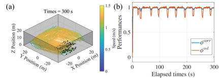
 

Collective motion in confined environments with the Vásárhelyi algorithm 

 

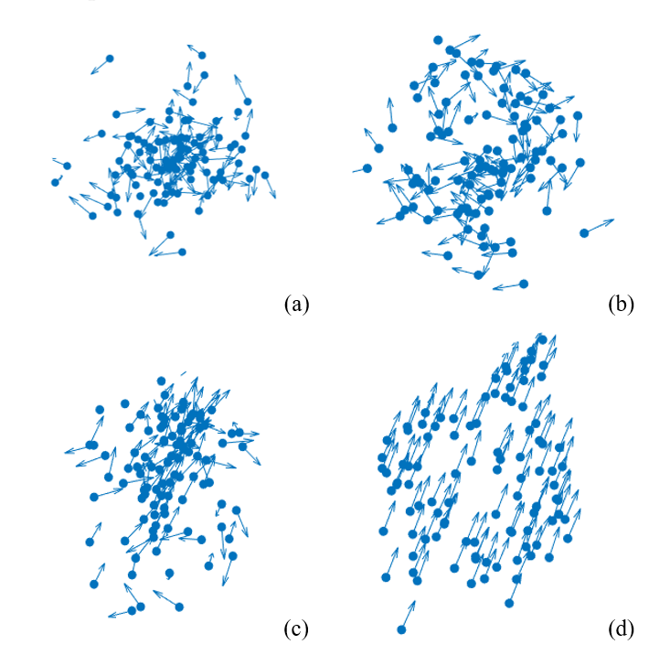
 

Theoretical research of collective motion with the Couzin algorithm (a) swarm (b) torus (c) dynamic parallel group (d) highly parallel group 

 

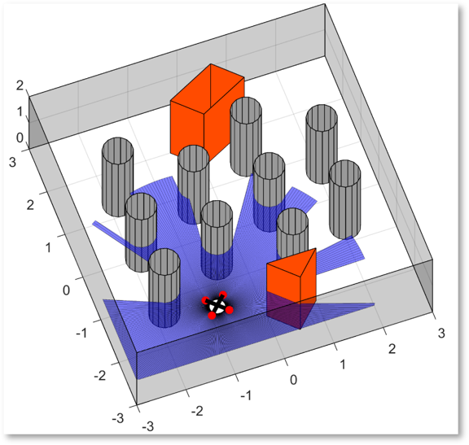
 

  Simulated environment and LIDAR
 

* Parameter auto-tuning for getting the optimized parameters

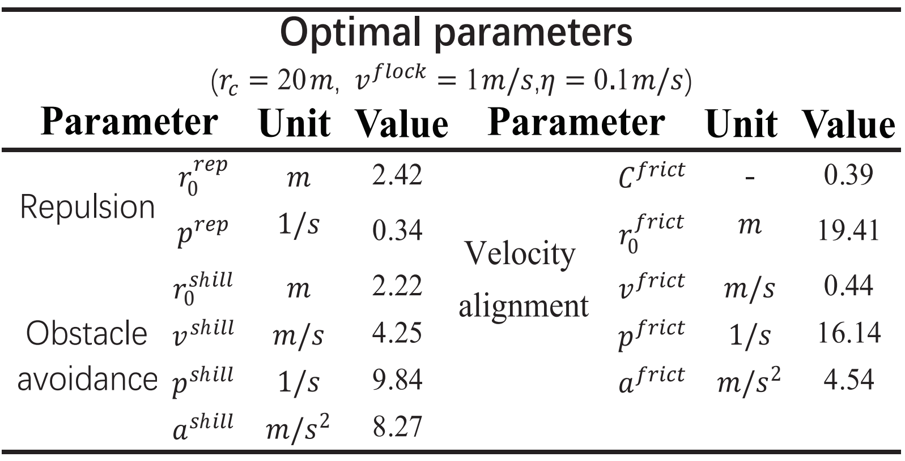
 

 Parameter auto-tuning of the Vásárhelyi algorithm 

* Batch processing for obtaining the impact of internal and external parameters on swarm performances

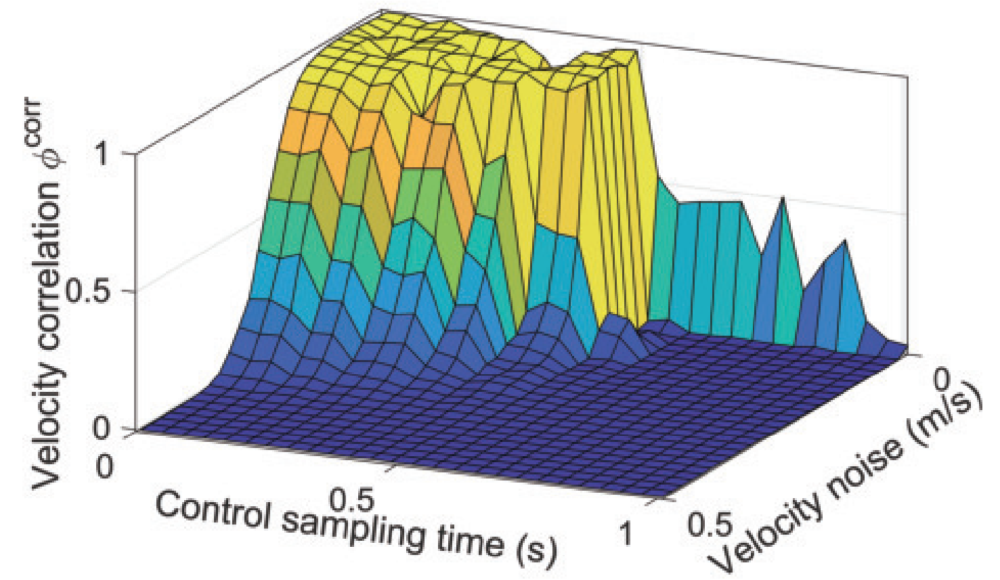
 

 Impact of the control sampling time and velocity noise on swarm velocity correlation using the Vásárhelyi algorithm
 

 

The verification system for drone swarm is written in MATLAB&Simulink and it uses the same commander to perform four functions with different platforms:
* Simple simulation with simulink simulator to verify the control programs.

* High-fidelity simulation with ROS&PX4&Gazebo
* Experimental verification with Tello&Optitrack
* Experimental verification with Crazyswarm

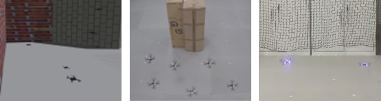

# Requirements

* Only [MATLAB R2021b](https://www.mathworks.com/support/install-matlab.html?q=&page=1) or later for prototype simulator, simulink simulator and simulink commander. (Ubuntu and Windows are supported)
* Working installation of [PX4](https://github.com/PX4/PX4-Autopilot) and [Gazebo](https://gazebosim.org/home) for high-fidelity simulation. (Ubuntu18.04 are supported)
* Working installation of [crazyswarm](https://github.com/USC-ACTLab/crazyswarm) for experimental verification with a motion capture system (Ubuntu18.04 are supported) or using our project for experimental verification with Tello&Optitrack (Windows are supported).

# Installation
1. Clone the *CoFlyers* git repository or download it directly:
<pre><code>
git clone https://github.com/micros-uav/CoFlyers.git
</code></pre>
2. For simulation with PX4, copy some files for PX4
<pre><code>
sudo cp ./CoFlyers/for_external_projects/PX4-Autopilot/my_world.world ./PX4-Autopilot/Tools/sitl_gazebo/worlds
sudo cp ./CoFlyers/for_external_projects/PX4-Autopilot/multi_uav_mavros_sitl_1.launch ./PX4-Autopilot/launch
sudo cp ./CoFlyers/for_external_projects/PX4-Autopilot/multi_uav_mavros_sitl_10.launch ./PX4-Autopilot/launch
</code></pre>
3. For experiments with Crazyswarm, copy some files for Crazyswarm
<pre><code>
sudo cp -r ./CoFlyers/for_external_projects/crazyswarm/crazyswarm_coflyers ./crazyswarm/ros_ws/src
cd ./crazyswarm/ros_ws
catkin_make
</code></pre>
Currently, it is a problem with the publish frequency to the /cf#/pose topic created by Crazyswarm. It cannot be performed at a faster frequency of 30 Hz. If users' Crazywarm can normally pulish poses to /cf#/pose topic at a frequency of 30 Hz, it is no need to replace the source code with the following command:
<pre><code>
sudo cp ./CoFlyers/for_external_projects/crazyswarm/crazyswarm_server.cpp ./crazyswarm/ros_ws/src/crazyswarm/src
cd ./crazyswarm/ros_ws
catkin_make
</code></pre>
4. Build:
<pre><code>
cd ./crazyswarm/ros_ws
catkin_make
</code></pre>

# Overview

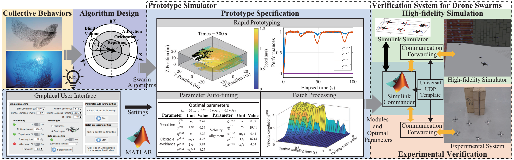
 

  Overall architecture of the platform
 

 

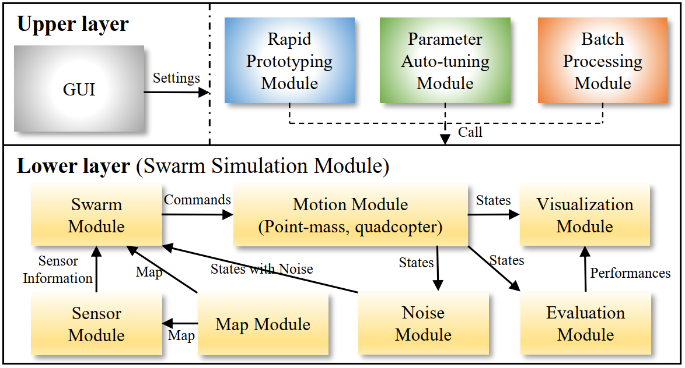
 

  Architecture of prototype simulator
 

 

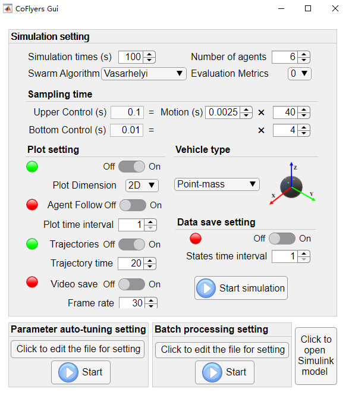
 

  Graphical user interface
 

 

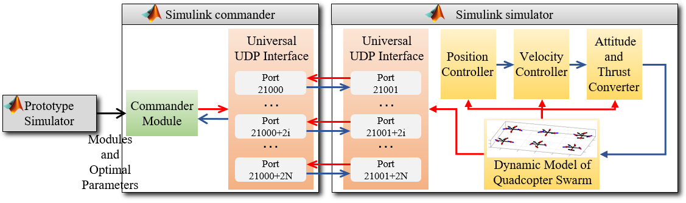
 

  Architecture of simulink simulation
 

 

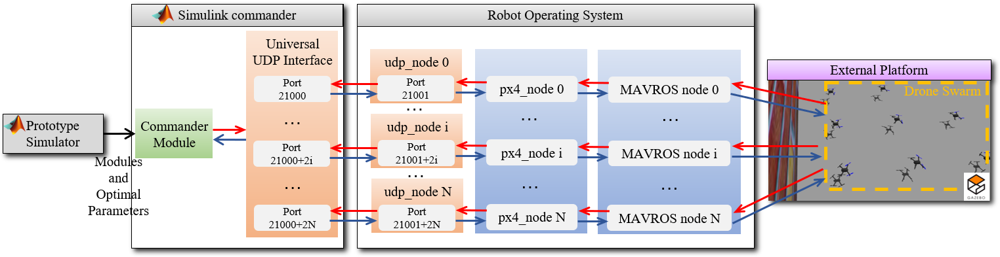
 

  Architecture of the simulation with ROS&PX4&Gazebo
 

 

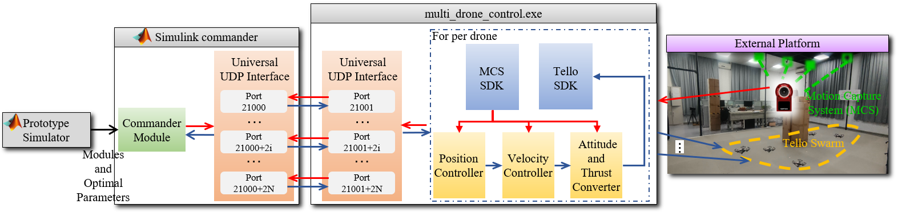
 

  Architecture of the experimental verification with Tellos&Optitrack
 

 >

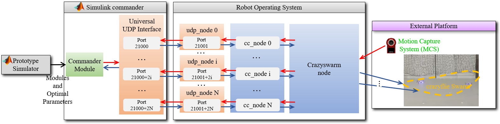
 

  Architecture of the experimental verification with Crazyswarm
 

# A step-by-step example
## Swarm theory
Our platform has integrated three algorithms: [Vásárhelyi](https://www.science.org/doi/10.1126/scirobotics.aat3536), Vásárhelyi+[will](http://dx.doi.org/10.1098/rsif.2019.0853), and [Couzin](https://www.sciencedirect.com/science/article/pii/S0022519302930651?via%3Dihub). The deployment of the Vásárhelyi algorithm has been described in the relevant paper on *CoFlyers*. To enable users to understand the use of Coflyers more quickly, here is an example of deploying a new algorithm theory on *CoFlyers* step by step.

The algorithm is a variant of the Vásárhelyi algorithm used to cross a area with dense obstacles. The desired velocity formula on the horizontal plane of the ith individual is as follows:
$$ \boldsymbol{v}^d_i=v^{flock}((1-\omega)\frac{\boldsymbol{v}_i}{|\boldsymbol{v}_i|}+\omega\boldsymbol{v}^t) + \boldsymbol{v}_i^{frict} + \boldsymbol{v}_i^{rep} + \sum_s{\boldsymbol{v}_{is}^{shill}}$$
where the first term is a tadeoff between self velocity direction and target direction with a constant $\omega$ between 0 and 1. The other three terms are used for ailgnment, repulsion and obstacle avoidance. See the original article of the Vásárhelyi algorithm for details. In addition, keep the agent at a specific height in the altitude direction.

In order to evaluate the performance of swarm, five metrics corresponding to the algorithm are proposed as follows:
* One function of the first term of the algorithm is to maintain agents' speed on $v^{flock}$. To evaluate this performance, a speed maintenance metric is used:
$$ \phi^{vel}=\sum^N_{i=1}|\boldsymbol{v}_i|/N/v^{flock} $$
* Another function of the first item  is to achieve the main purpose of crossing a area with obstacles to the target area. For this purpose, a crossing completion metric is used:
$$\phi^{cross}=\sum^N_{i=1}\frac{1-T^{end}_i}{T}/N$$
where $T^{end}_i$ is the consuming time and T is the total time.
* To evaluate the alignment effect of the second term, a velocity correlation metric is used
$$ \phi^{corr}=\frac{1}{N(N-1)}\sum^N_{i=1}\sum_{j\not ={i}}\frac{\boldsymbol{v}_i\cdot\boldsymbol{v}_j}{|\boldsymbol{v}_i||\boldsymbol{v}_j|}$$
* To evaluate the repulsion effect of the third term, a metric of collision risk between agents is used:
$$ \phi^{corr}=\frac{1}{N(N-1)}\sum^N_{i=1}\sum_{j\not ={i}}\Theta(d^{coll}-d)$$
where $d^{coll}$ is a dangerous distance around agents. $\Theta(d)=1$ when $d>0$, otherwise $\Theta(d)=0$.
* To evaluate the repulsion effect of the fourth term, a metric of collision risk between agents and obstacles is used:
$$\phi^{wall}=\sum^N_{i=1}H_i/N$$
where $H_i=0$ when an agent is inside an obstacle or outside boundaries, otherwise 0.
* To automatically tune swarm parameters, it needs to integrate the five metrics into a fitness value:
$$F=1-\frac{(Sat(\widetilde{\phi}^{vel})\widetilde{\phi}^{corr}\phi^{cross})}{(\widetilde{\phi}^{wall}/\lambda+1)^2 (\widetilde{\phi}^{coll}/\lambda+1)^2}$$
where $\widetilde{\phi}$ is the time average of metrics and $\lambda$ is a constanst.

Now, the algorithm and metrics have been designed. Consider the following scenario. A group of 8 agents moves within the boundaries in the X range of [-3m, 3m] and the Y range of [-2m, 2m]. There are 8 cylindrical obstacles with a radius of 0.15m uniformly distributed in the center of the map. The group is required to cross the area with dense obstacles from one end of the map to reach the other end. 
## Prototype specification
### Rapid prototyping
Next, we implement this scenario in the prototype simulator.

Open MATLAB, enter the workspace of the protopyer simulator and add the files to the MATLAB path:
<pre><code>cd /path/to/Coflyers/matlab_simulink_ws/Prototype_Simulator
addpath(genpath("."))</code></pre>

Since the algorithm in this section inherits from the Vásárhelyi algorithm, we directly copy the corresponding module of the Vásárhelyi algorithm as a new module, and modify the corresponding function name:
<pre><code>copyfile('lower_layer/swarm_module/Vasarhelyi_module', 'lower_layer/swarm_module/Vasarhelyi_c_module')
% Then modify the corresponding function names from Vasarhelyi_XXX to Vasarhelyi_c_XXX.</code></pre>

In Vasarhelyi_c_module_parameters.m, add three extra parameters:
<pre><code>
dr = 0.1; 
[numS,posShill,velShill] = generateShills(map_lines,dr);
% Crossing
omega = 0.5; v_target = [1;0]; x_finished = 1.5;
%%% Merge all parameters to an array
parameters_flocking = […; omega; v_target; x_finished];
</code></pre>

In Vasarhelyi_c_module_parameters_deal.m, add the allocatoon of the three params:
<pre><code>
[r_com,v_flock,r_rep0,p_rep,r_frict0,C_frict,v_frict,p_frict,a_frict,r_shill0,...
    v_shill,p_shill,a_shill,v_max,number_h,heights,numS,posShill,velShill,omega,v_target,x_finished] =...
Vasarhelyi_c_module_parameters_deal(parameters_flocking)
…
omega   = parameters_flocking(myCount); myCount = myCount + 1;
v_target   = parameters_flocking(myCount:myCount+1); myCount = myCount + 2;
x_finished   = parameters_flocking(myCount); myCount = myCount + 1;
</code></pre>

In Vasarhelyi_c_module_generate_desire_i.m, add the acquisition of the new params and the crossing rule:
<pre><code>
[r_com,v_flock,r_rep0,p_rep,r_frict0,C_frict,v_frict,p_frict,a_frict,r_shill0,...
    v_shill,p_shill,a_shill,v_max,~,heights,~,posShill,velShill,omega,v_target] =...
Vasarhelyi_c_module_parameters_deal(parameters_flocking);
%Self-propelling term
…
vFlockId(1:dimension) = (1-omega)*vFlockId(1:dimension) + omega*v_flock*v_target;
</code></pre>

The distributed algorithm is implemented in Vasarhelyi_c_module_generate_desire_i.m, while Vasarhelyi_c_module_generate_desire.m can centrally process all agents' data. Here, add the determination of whether agents has completed crossing and use the completed flag as a function output to calculate crossing completion metric $\phi^{cross}$ in evaluation module:
<pre><code>
function [command_upper_s,control_mode_s,finished] =...
Vasarhelyi_c_module_generate_desire(t,states,parameters_flocking,map_lines,map_grid,parameters_sensor_env)
…
[r_com,~,~,~,~,~,~,~,~,~,~,~,~,~,~,~,~,~,~,~,~,x_finished] =...
Vasarhelyi_c_module_parameters_deal(parameters_flocking);
…
    %%%%%Distributed control%%%%%
    [posDesired_id,velDesired_id,accDesired_id,control_mode_id] =...
            Vasarhelyi_c_module_generate_desire_i(id,state_i,states_neighbor,...
            dis_to_neighbor,posid_to_neighbor,parameters_flocking,map_lines,map_grid,datas_sensor_env);
…
command_upper_s = [posDesired;velDesired;accDesired];
%%%%%Finished%%%%%
finished = states(1,:) > x_finished;
</code></pre>

In swarm_module_parameters.m, add a branch of the new algorithm:
<pre><code>
    case 3
        parameters_swarm =Vasarhelyi_c_module_parameters(number_h, map_lines);
</code></pre>

In swarm_module_generate_desire.m, add a branch of the new algorithm and a new output:
<pre><code>
function [command_upper_s,control_mode_s,data_swarm_for_visual,finished] = ... 
swarm_module_generate_desire(t,states,parameters_swarm,map_lines,map_grid,parameters_sensor_env,flag_alg,sample_time)
…
finished = [];
…
    case 3
        [command_upper_s,control_mode_s,finished] =... 
Vasarhelyi_c_module_generate_desire(t,states,parameters_swarm_sub,map_lines,map_grid,parameters_sensor_env);
</code></pre>

Next, implement the performance metrics.

Since the metric set in this section is similar to the metric set 0, we directly copy the corresponding module of the metric set 0 as a new module, and modify the corresponding function name:
<pre><code>copyfile('lower_layer/evaluation_module/evaluation_0_module', 'lower_layer/evaluation_module/evaluation_2_module') 
% Then modify the corresponding function names from evaluation_0_XXX to evaluation_2_XXX.</code></pre>

Since the required parameters are the same as the set 0, it is no need to modify the evaluation_ 2_ module_parameters.m and evaluation_2_module_parameters_deal.m.
Open evaluation_2_module_one.m and add the calculation of crossing completion metric:
<pre><code>
[values, values_for_visual] = evaluation_2_module_one(t, states, parameters_evalue, map_grid, parameters_map, finished, time_max)
[v_flock,rColl,~,~,~] =...
    evaluation_2_module_parameters_deal(parameters_evalue);
…
persistent T_finished_pre
if t == 0 || isempty(T_finished_pre)
    T_finished_pre = zeros(1,number) + time_max;
end
T_finished_now = finished*t;
T_finished_now(T_finished_now==0) = inf;
T_finished_now = min(T_finished_now,T_finished_pre);
T_finished_pre = T_finished_now;
phi_cross = mean(1- T_finished_now/time_max);
values = [phiCorr;phiVel;phiColl;phiWall;phiMND;phi_cross];
</code></pre>

In evaluation_2_module_average.m, add the calculation of crossing completion metric:
<pre><code>
phiCross = values_series(6,end);
[~,~,~,~,F] = fitness_function_combine(v_flock,aTol,vTol,rTol,phiVel, ...
phiColl,phiWall,phiCorr*phiCross);
values = [F;phiCorr;phiVel;phiColl;phiWall;phiMND;phiCross];
</code></pre>

In evaluation_module_one.m, add a branch of the new set of metrics and the input of the total time:
<pre><code>
[values, values_for_visual] = evaluation_module_one(t, states,parameters_evalue,map_grid,parameters_map,flag_evalue,finished,time_max)
…
    case 2
        [values, values_for_visual] = evaluation_2_module_one(t, states, parameters_evalue_sub, map_grid, parameters_map, finished, time_max);
</code></pre>

In evaluation_module_parameters.m, add a branch of the new set of metrics:
<pre><code>
    case 2
        parameters_evalue_sub = evaluation_2_module_parameters(v_flock);
</code></pre>

In evaluation_module_average.m, add a branch of the new set of metrics:
<pre><code>
    case 2
        [values] = evaluation_2_module_average(values_series,parameters_evalue_sub);
</code></pre>

Next, modify the map module.
Open map_module_parameters.m and change:
<pre><code>
xrange =[-3,3];
yrange =[-2,2];
cylinder_radius      = 0.15;
cylinder_rows_number = 3;
cylinder_cols_number = 3;
cylinder_delta_x     = 1.0;
cylinder_delta_y     = 1.15; 
cylinder_offset_x    = 0;
cylinder_offset_y    = 0; 
cylinder_disc_num    = 15;
</code></pre>

Due to the previous changes to the input and output of some functions, we need to modify the functions used to integrate various modules.
In model_swarm.m, modify the following
<pre><code>
%%% Initialize states
…
[commands_upper,control_mode_s,data_swarm_for_visual,finished] =...
    swarm_module_generate_desire(t,states_m,parameters_flocking,map_lines,map_grid,parameters_sensor_env, flag_alg,sample_time_control_u);
[values,values_for_visual] = evaluation_module_one(t, states, parameters_evalue, map_grid, parameters_map, flag_eva, finished, time_max);

% Get desired position and velocity from flocking rules
if mod(count,rate_upper) == 0
        [commands_upper,control_mode_s,data_swarm_for_visual,finished] =...
            swarm_module_generate_desire(t,states_m,parameters_flocking,map_lines,map_grid,...
            parameters_sensor_env, flag_alg,sample_time_control_u);
end
…
% Calculate the performance of current frame
[values, values_for_visual] = evaluation_module_one(t, states_ob, parameters_evalue, map_grid, parameters_map, flag_eva, finished, time_max);
</code></pre>

In initialize_parameters_states.m, modify the following:
<pre><code>
%%% Swarm parameters. 3th module
    case 3
        [~, v_flock] = Vasarhelyi_c_module_parameters_deal(parameters_swarm_sub);
</code></pre>

Open initialize_states.m, change the initial positions:
<pre><code>
position = [-2.5,-2.5,-2.5,-2.5,-1.5,-1.5,-1.5,-1.5;
    -1.5,-0.5,0.5,1.5,-1.5,-0.5,0.5,1.5;
    0,0,0,0,0,0,0,0];
</code></pre>

In parameters_setting_get.m, change the number of agents to 8 and select the algorithm and the metric set:
<pre><code>
number   = 8; 
time_max  = 70;
…
flag_alg  = 3;
flag_eva = 2;
</code></pre>

Now, we can run main_rapid_prototyping.m and observe the results. But we saw that the group did not move, which is because the current swarm parameters are not suitable for the current scenario. We can try to manually tune the parameters, but it is difficult to get a suitable parameter setting. 
### Parameter auto-tuning and batch processing
Next, we can obtain the optimized parameters through the parameter auto-tuning module.

In main_auto_tuning.m, modify the following:
<pre><code>
%% Settings of auto-tuning 
% Lower boundary and upper boundary of optimization
flag_use_parallel     = true;
repeat_times        = 1; %Times of experimental repetitions used to average multiple simulations
%====[rRep0====pRep=rFrict0====CFrict====vFrict====pFrict====aFrict====rShill0===vShill====pShill====aShill===omega]
lower_boudaries = [0.2000   0.01   00.1000    0.0100    0.0100    0.1000    0.0100    0.0100   0.0100    0.0100    0.0100, 0.0];
upper_boudaries = [2.0000    1.0   10.0000     0.500    0.2000    10.000    1.000     1.000    2.000    1000     1000, 1.0];
order_s = [3:13,1081];
flag_alg_opt = 0; % 0: genetic algorithm, 1: particle swarm optimization
</code></pre>

In order to see the results quickly, set repeat_times=1 (To reduce accidental errors, you need to increase this parameter). In addition, the parameter list is one more parameter $\omega$ than the Vashelyi algorithm. The serial number of this parameter in the swarm parameter is 1081. Run the script (takes about half an hour) and obtain the optimized parameters.
Modify the Vasaryi_c_module_parameters.m:
<pre><code>
rRep0   = 1.1376;										
pRep    = 0.9535;	
rFrict0 = 6.5789;	
CFrict  = 0.4896;	
vFrict  = 0.0219;	
pFrict  = 1.5641;	
aFrict  = 0.0385;	
rShill0 = 0.0870;	
vShill  = 0.4683;	
pShill  = 105.7271;	
aShill  = 554.5390;
…
omega = 0.4638;
</code></pre>

Run main_rapid_prototyping.m and observe the results again.

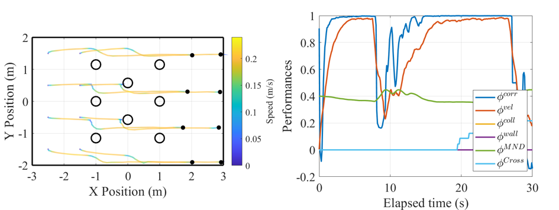

The batch processing module is mainly used to customize parameter combinations through the get_value_combinations() function in main_batch_processing.m. The script used for the Vásárhelyi algorithm can also be used for the algorithm in this section to get the impact of control sampling time and velocity noise on swarm performances.

In addition, users can easily adjust the drawing parameters and save data, images, videos, etc. on the *CoFlyers* GUI. Due to the addition of the new algorithm and the new metric set, a little extra settings are required. Double click and open CoFlyersGUI.mlapp in appdesigner. In design view, add an additional item in the two drop-down boxes of 'Swarm Algorithm' and 'Evaluation Metrics'.

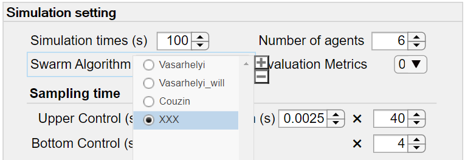

## Further verification
Next, users can perform further verification through the Simulink commander. Enter the workspace 'Simulink_module', input 'addpath (genpath ("."))' to add all files to the MATLAB path. 
In the initialization file of init_condition.m, change the number to 8, and run the script. This script obtains the map module parameters, map, and swarm module parameters from the prototype simulator. Since the input and output have not been modified, it is no need to modify them here.
### Simulink simulation

First, we verify that the model is functioning properly without external platforms.
In the model of testControlWithDroneSwarm.slx, modify the ip address of UDP as local ip address:

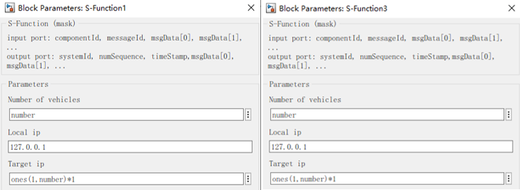

Next, because simulink cannot run two models at the same time, open another MATLAB to run the simulator.
Enter path of Simulink_Module\simulator and add the matlab_simulink_ws folder to the MATLAB path. In the initialization file of initial_condition_sim.m, change the number to 8, and change the initial positions:
<pre><code>
position = [-2.5,-2.5,-2.5,-2.5,-1.5,-1.5,-1.5,-1.5;
    -1.5,-0.5,0.5,1.5,-1.5,-0.5,0.5,1.5;
    0,0,0,0,0,0,0,0];
</code></pre>

Open quadcoptersVerification.slx and run it, and we can see 8 quadcopters. Meanwhile, run the testControlWithDroneSwarm.slx in another MATLAB. Turn the rotary switch to 'takeoff'. When the drones hover, turn the switch to 'alg', and we will see the drones flying according to the swarm algorithm. Then, turn the rotary switch to 'land', and the drones will land. If everything runs normally, further verification can be performed with external platforms.
### Simulation with PX4&Gazebo
Under Ubuntu system, copy multi_uav_mavros_sitl_10.launch as multi_uav_mavros_sitl_8.launch in the path of ~/PX4-Autopilot/launch and delete two UAVs. In addition, modify the ip addresses and initial positions in the .launch file. 
Similarly copy px4_node_multiple_10.launch as px4_node_multiple_8.launch in the path of ~/CoFlyers/ros_ws\src\px4_sitl_coflyers\launch and delete two UAVs. In addition, modify the ip addresses and initial positions in the .launch file. The ip addresses also need to modify in the simulink commander. 
Then start Px4 sitl with Gazebo:
<pre><code>
cd ~/PX4-Autopilot
roslaunch px4 multi_uav_mavros_sitl_8.launch
</code></pre>
Start ros nodes to communicate with simulink commander in a new shell:
<pre><code>
cd ~/CoFlyers/ros_ws
source devel/setup.bash
roslaunch px4_sitl_coflyers px4_node_multiple_8.launch
</code></pre>
Now, we can run testControlWithDroneSwarm.slx to control the drones in Gazebo.

### Experimental verification with Tello swarm
Under Windows system, configure configuration_swarm.txt in CoFlyers/tello_optitrack_win/drone_swarm_v19/x64/Debug/config. Then run multi_drone_control.exe in the path of CoFlyers/tello_optitrack_win/drone_swarm_v19/x64/Debug. This program will continuously obtain the poses of tellos from the Optitrack and send them to the simulink commander, and receive commanders from the simulink commander and send them to the tellos.

Now, we can run testControlWithDroneSwarm.slx to control the tellos to verify the swarm algorithm experimentally.

### Experimental verification with Crazyswarm
Under Ubuntu system, open a new shell:
<pre><code>
cd ~/crazyswarm/ros_ws
source devel/setup.bash
roslaunch crazyswarm hover_swarm.launch
</code></pre>

Open a new shell:
<pre><code>
cd ~/crazyswarm/ros_ws
source devel/setup.bash
roslaunch crazyswarm_coflyers crazyswarm_coflyers_run.launch
</code></pre>

Open a new shell:
<pre><code>
cd ~/CoFlyers/ros_ws
source devel/setup.bash
roslaunch udp_common udp_node_.launch udp_node_uav_multiple_10.launch
</code></pre>

Now, we can run testControlWithDroneSwarm.slx to control the Crazyflies to verify the swarm algorithm experimentally.

# Troubleshooting
Please open an [Issue](https://github.com/micros-uav/CoFlyers/issues) if you have some droubles and advice.

The document is being continuously updated.