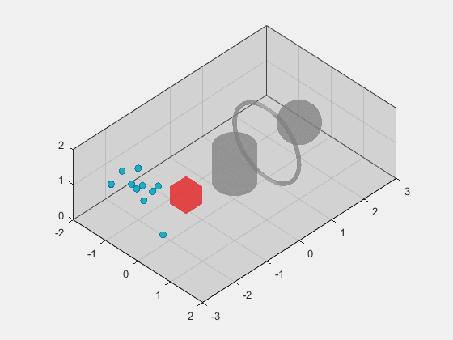

# CoFlyers
CoFlyers: a universal platform for collective flying of swarm drones

# This document construction of the latest version is in progress.

xxx

## Contents
<!-- @import "[TOC]" {cmd="toc" depthFrom=2 depthTo=6 orderedList=false} -->

<!-- code_chunk_output -->

- [CoFlyers](#coflyers)
- [This document construction is in progress.](#this-document-construction-is-in-progress)
  - [Contents](#contents)
  - [Introduction](#introduction)
  - [Requirements](#requirements)
  - [Installation](#installation)
  - [Overview](#overview)
    - [Prototype simulator](#prototype-simulator)
      - [Map module](#map-module)
      - [Graphical user interface](#graphical-user-interface)
    - [Verification system for drone swarm](#verification-system-for-drone-swarm)
  - [A step-by-step example](#a-step-by-step-example)
    - [Swarm theory](#swarm-theory)
    - [Others](#others)
  - [Troubleshooting](#troubleshooting)

<!-- /code_chunk_output -->

## Introduction

*CoFlyers* is a drone swarm platform mainly written in MATLAB&Simulink. The main components of the platform are a prototype simuator and a verification system for drone swarm.
The prototype simulator is written in MATLAB and has three functions:
* Rapid protyping

Collective motion in confined environments with the Vásárhelyi algorithm

 

Simulated environment and LIDAR

 

* Parameter auto-tuning for getting the optimized parameters

Parameter auto-tuning of the Vásárhelyi algorithm

* Batch processing for obtaining the impact of internal and external parameters on swarm performances

Impact of the control sampling time and velocity noise on swarm velocity correlation using the Vásárhelyi algorithm

 

The verification system for drone swarm is written in MATLAB&Simulink and it uses the same commander to perform four functions with different platforms:
* Simple simulation with simulink simulator to verify the control programs.

* High-fidelity simulation with ROS&PX4&Gazebo
* Experimental verification with Tello&Optitrack
* Experimental verification with Crazyswarm

## Requirements

* Only [MATLAB R2021b](https://www.mathworks.com/support/install-matlab.html?q=&page=1) or later for prototype simulator, simulink simulator and simulink commander. (Ubuntu and Windows are supported)
* Working installation of [PX4](https://github.com/PX4/PX4-Autopilot) and [Gazebo](https://gazebosim.org/home) for high-fidelity simulation. (Ubuntu18.04 are supported)
* Working installation of [crazyswarm](https://github.com/USC-ACTLab/crazyswarm) for experimental verification with a motion capture system (Ubuntu18.04 are supported) or using our project for experimental verification with Tello&Optitrack (Windows are supported).

## Installation
1. Clone the *CoFlyers* git repository or download it directly:
<pre><code>git clone https://github.com/micros-uav/CoFlyers.git</code></pre>

2. For simulation with PX4, copy some files for PX4
<pre><code>sudo cp ./CoFlyers/for_external_projects/PX4-Autopilot/my_world.world ./PX4-Autopilot/Tools/sitl_gazebo/worlds
sudo cp ./CoFlyers/for_external_projects/PX4-Autopilot/multi_uav_mavros_sitl_1.launch ./PX4-Autopilot/launch
sudo cp ./CoFlyers/for_external_projects/PX4-Autopilot/multi_uav_mavros_sitl_10.launch ./PX4-Autopilot/launch</code></pre>

3. For experiments with Crazyswarm, copy some files for Crazyswarm
<pre><code>sudo cp -r ./CoFlyers/for_external_projects/crazyswarm/crazyswarm_coflyers ./crazyswarm/ros_ws/src
cd ./crazyswarm/ros_ws
catkin_make</code></pre>
Currently, it is a problem with the publish frequency to the /cf#/pose topic created by Crazyswarm. It cannot be performed at a faster frequency of 30 Hz. If users' Crazywarm can normally pulish poses to /cf#/pose topic at a frequency of 30 Hz, it is no need to replace the source code with the following command:
<pre><code>sudo cp ./CoFlyers/for_external_projects/crazyswarm/crazyswarm_server.cpp ./crazyswarm/ros_ws/src/crazyswarm/src
cd ./crazyswarm/ros_ws
catkin_make</code></pre>

4. Build:
<pre><code>cd ./crazyswarm/ros_ws
catkin_make</code></pre>

## Overview

Overall architecture of the platform

 

Parameters of the All modules are defined in [parameters.xml](./matlab_simulink_ws/Prototype_Simulator/parameters.xml). Add a new module XXX in the 'swarm' module in this file, similar to the 'Vasarhelyi' module. Then our program will automatically generate some files of the 'XXX' module for customizing collective rules after running [read_parameter_xml.m](./matlab_simulink_ws/Prototype_Simulator/utils/read_parameter_xml.m).

### Prototype simulator

Architecture of prototype simulator

 

#### Map module

3D map define

 

#### Graphical user interface

Graphical user interface

### Verification system for drone swarm

 

Architecture of simulink simulation

 

Architecture of the simulation with ROS&PX4&Gazebo

 

Architecture of the experimental verification with Tellos&Optitrack

 >

Architecture of the experimental verification with Crazyswarm

## A step-by-step example
### Swarm theory
Our platform has integrated the [Vásárhelyi](https://www.science.org/doi/10.1126/scirobotics.aat3536) algorithm as an example. To enable users to understand the use of Coflyers more quickly, here is an example of deploying a new algorithm theory on *CoFlyers* step by step.

The algorithm is a variant of the Vásárhelyi algorithm used to cross a area with dense obstacles. The desired velocity formula on the horizontal plane of the ith individual is as follows:

<!-- $$ \boldsymbol{v}^d_i=v^{flock}((1-\omega)\frac{\boldsymbol{v}_i}{|\boldsymbol{v}_i|}+\omega\boldsymbol{v}^t) + \boldsymbol{v}_i^{frict} + \boldsymbol{v}_i^{rep} + \sum_s{\boldsymbol{v}_{is}^{shill}}$$ -->
$$ {v}^d_i=v^{flock}((1-\omega)\frac{{v}_i}{|{v}_i|}+\omega{v}^t) + {v}_i^{frict} + {v}_i^{rep} + \sum_s{{v}_{is}^{shill}}$$

where the first term is a tadeoff between self velocity direction and target direction with a constant $\omega$ between 0 and 1. The other three terms are used for ailgnment, repulsion and obstacle avoidance. See the original article of the Vásárhelyi algorithm for details. In addition, keep the agent at a specific height in the altitude direction.

In order to evaluate the performance of swarm, five metrics corresponding to the algorithm are proposed as follows:
* One function of the first term of the algorithm is to maintain agents' speed on $v^{flock}$. To evaluate this performance, a speed maintenance metric is used:
<!-- $$ \phi^{vel}=\sum^N_{i=1}|\boldsymbol{v}_i|/N/v^{flock} $$ -->
$$ \phi^{vel}=\sum^N_{i=1}|{v}_i|/N/v^{flock} $$

* Another function of the first item  is to achieve the main purpose of crossing a area with obstacles to the target area. For this purpose, a crossing completion metric is used:
$$\phi^{cross}=\sum^N_{i=1}\frac{1-T^{end}_i}{T}/N$$
where $T^{end}_i$ is the consuming time and T is the total time.
* To evaluate the alignment effect of the second term, a velocity correlation metric is used
<!-- $$ \phi^{corr}=\frac{1}{N(N-1)}\sum^N_{i=1}\sum_{j\not ={i}}\frac{\boldsymbol{v}_i\cdot\boldsymbol{v}_j}{|\boldsymbol{v}_i||\boldsymbol{v}_j|}$$ -->
$$ \phi^{corr}=\frac{1}{N(N-1)}\sum^N_{i=1}\sum_{j\not ={i}}\frac{{v}_i\cdot{v}_j}{|{v}_i||{v}_j|}$$
* To evaluate the repulsion effect of the third term, a metric of collision risk between agents is used:
$$ \phi^{corr}=\frac{1}{N(N-1)}\sum^N_{i=1}\sum_{j\not ={i}}\Theta(d^{coll}-d)$$
where $d^{coll}$ is a dangerous distance around agents. $\Theta(d)=1$ when $d>0$, otherwise $\Theta(d)=0$.
* To evaluate the repulsion effect of the fourth term, a metric of collision risk between agents and obstacles is used:
$$\phi^{wall}=\sum^N_{i=1}H_i/N$$
where $H_i=0$ when an agent is inside an obstacle or outside boundaries, otherwise 0.
* To automatically tune swarm parameters, it needs to integrate the five metrics into a fitness value:
$$F=1-\frac{(Sat(\widetilde{\phi}^{vel})\widetilde{\phi}^{corr}\phi^{cross})}{(\widetilde{\phi}^{wall}/\lambda+1)^2 (\widetilde{\phi}^{coll}/\lambda+1)^2}$$
where $\widetilde{\phi}$ is the time average of metrics and $\lambda$ is a constanst.

Now, the algorithm and metrics have been designed. Consider the following scenario. A group of 8 agents moves within the boundaries in the X range of [-3m, 3m] and the Y range of [-2m, 2m]. There are 8 cylindrical obstacles with a radius of 0.15m uniformly distributed in the center of the map. The group is required to cross the area with dense obstacles from one end of the map to reach the other end. 
### Others

Coming soon.

## Troubleshooting
Please open an [Issue](https://github.com/micros-uav/CoFlyers/issues) if you have some droubles and advice.

The document is being continuously updated.
