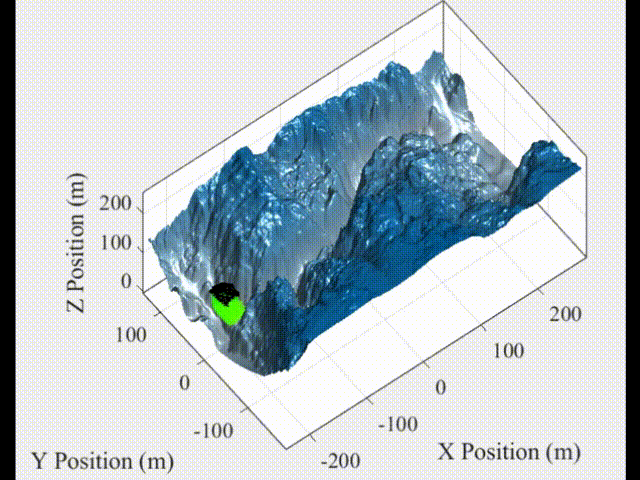
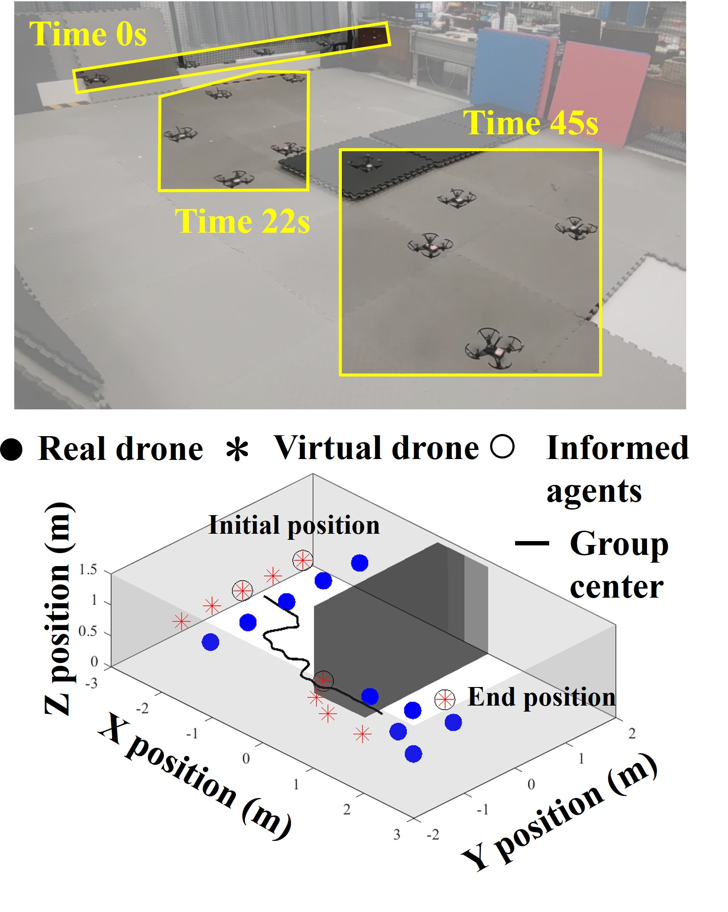

# CoFlyers
CoFlyers: a universal platform for collective flying of swarm drones

IROS2023

<p align="center">

</p>


## Contents
<!-- @import "[TOC]" {cmd="toc" depthFrom=2 depthTo=6 orderedList=false} -->

<!-- code_chunk_output -->

- [CoFlyers](#coflyers)
  - [Contents](#contents)
  - [Introduction](#introduction)
  - [Requirements](#requirements)
  - [Installation](#installation)
  - [Overview](#overview)
    - [Prototype simulator](#prototype-simulator)
    - [Graphical user interface for drwaing](#graphical-user-interface-for-drwaing)
    - [Graphical user interface for simulating](#graphical-user-interface-for-simulating)
    - [Verification system for drone swarms](#verification-system-for-drone-swarms)
  - [A step-by-step example](#a-step-by-step-example)
    - [Swarm algorithm and evaluation metrics](#swarm-algorithm-and-evaluation-metrics)
    - [Rapid prototyping of swarm algorithms](#rapid-prototyping-of-swarm-algorithms)
    - [Parameter auto-tuning of swarm algorithms](#parameter-auto-tuning-of-swarm-algorithms)
    - [Batch-processing analysis of swarm algorithms](#batch-processing-analysis-of-swarm-algorithms)
    - [High-fidelity simulation of swarm algorithms](#high-fidelity-simulation-of-swarm-algorithms)
    - [Real-world experimental verification with Tello\&OptiTrack](#real-world-experimental-verification-with-tellooptitrack)
    - [Real-world experimental verification with Crazyswarm\&OptiTrack](#real-world-experimental-verification-with-crazyswarmoptitrack)
    - [Verification combined with reality and virtuality](#verification-combined-with-reality-and-virtuality)
  - [Troubleshooting](#troubleshooting)

<!-- /code_chunk_output -->

## Introduction

*CoFlyers* is a platform for evaluating and verifying cooperative motion algorithm/model of drone swarms. It only requires users to have programming skills in MATLAB&Simulink. *CoFlyers* allows users to perform six typical functions: rapid prototyping, parameter auto-tuning, batch processing, high-fidelity simulation, real-world experimental verification, and verification combined with virtual and reality.


* Rapid protyping

<p align="center">

</p>

<p align="center" style="color: #999;">
Collective motion in confined environments with the Vásárhelyi algorithm
</p>

<br>


<p align="center">

</p>
<p align="center" style="color: #999;">
Simulated environment and LIDAR
</p>
<br>

<p align="center">

</p>
<p align="center" style="color: #999;">
Terrain based on an elevation map
</p>
<br>


* Parameter auto-tuning for getting the optimized parameters
<p align="center">

</p>
<p align="center" style="color: #999;">
Parameter auto-tuning of the Vásárhelyi algorithm
</p>


* Batch processing for obtaining the impact of internal and external parameters on swarm performances
<p align="center">

</p>
<p align="center" style="color: #999;">
Impact of the control sampling time and velocity noise on swarm velocity correlation using the Vásárhelyi algorithm
</p>


<br>


* High-fidelity simulation with ROS&PX4&Gazebo
* Eeal-world experimental verification with Tello&Optitrack
* Eeal-world experimental verification with Crazyswarm&Optitrack
<p align="center">

</p>

* verification combined with virtual and reality
<p align="center">

</p>

## Requirements

* Only [MATLAB R2021b](https://www.mathworks.com/support/install-matlab.html?q=&page=1) or later for prototype simulator, simulink commander. (Ubuntu and Windows are supported)
* Working installation of [PX4](https://github.com/PX4/PX4-Autopilot) and [Gazebo](https://gazebosim.org/home) for high-fidelity simulation. (Ubuntu18.04 are supported)
* For the implementation of real-world experimental verification with Tello&OptiTrack, a Windows system is required without any other dependencies.
* Working installation of [crazyswarm](https://github.com/USC-ACTLab/crazyswarm) for real-world experimental verification with Crazyswarm&OptiTrack (Ubuntu18.04 are supported).

## Installation
1. Clone the *CoFlyers* git repository or download it directly:
<pre><code>git clone https://github.com/micros-uav/CoFlyers.git</code></pre>

2. For simulation with PX4, copy some files for PX4
<pre><code>sudo cp ./CoFlyers/for_external_projects/PX4-Autopilot/my_world.world ./PX4-Autopilot/Tools/sitl_gazebo/worlds
sudo cp ./CoFlyers/for_external_projects/PX4-Autopilot/multi_uav_mavros_sitl_1.launch ./PX4-Autopilot/launch
sudo cp ./CoFlyers/for_external_projects/PX4-Autopilot/multi_uav_mavros_sitl_10.launch ./PX4-Autopilot/launch</code></pre>

3. For experiments with Crazyswarm, copy some files for Crazyswarm
<pre><code>sudo cp -r ./CoFlyers/for_external_projects/crazyswarm/crazyswarm_coflyers ./crazyswarm/ros_ws/src
cd ./crazyswarm/ros_ws
catkin_make</code></pre>
Currently, it is a problem with the publish frequency to the /cf#/pose topic created by Crazyswarm. It cannot be performed at a faster frequency of 30 Hz. If users' Crazywarm can normally pulish poses to /cf#/pose topic at a frequency of 30 Hz, it is no need to replace the source code with the following command:
<pre><code>sudo cp ./CoFlyers/for_external_projects/crazyswarm/crazyswarm_server.cpp ./crazyswarm/ros_ws/src/crazyswarm/src
cd ./crazyswarm/ros_ws
catkin_make</code></pre>

Build:
<pre><code>cd ./crazyswarm/ros_ws
catkin_make</code></pre>

## Overview

<p align="center">

</p>
<p align="center" style="color: #999;">
Overall architecture of CoFlyers
</p>

<br>

The platform of *CoFlyers* generally has four components: a prototype simulator, a verification system for drone swarms, a graphical user interface (GUI) for drawing, and a GUI for simulating. The prototype simulator provides the functions of rapid prototyping, parameter auto-tuning, and batch processing. The verification system for drone swarms provides the functions of high-fidelity simulation, real-world experimental verification, and verification combined with vitual and reality. The GUI for drawing allows users to interactively edit 3D simulated obstacle environments. The GUI for simulating allows users to interactively operate the prototype simulator, manually tune parameters, and observe simulation results. The prototype simulator and the two GUI are developed entirely based on the MATLAB programming language. And the verification system for drone swarms directly inherits the modules of the prototype simulator, relying on the characteristics of Simulink, which is integrated with MATLAB. In this way, users are not required to repeat programming while using advanced functions.

### Prototype simulator

<p align="center">

</p>
<p align="center" style="color: #999;">
Architecture of prototype simulator
</p>

<br>

The prototype simulator is developed based on a layered and modular idea. Its layers and modules are shown in the above figure. The swarm module and evaluation module are the main modules that users need to pay attention to and develop. The two are used respectively for deploying swarm algorithms and evaluation metrics of swarm performances.

The module parameters of the simulator are all configured in a parameter configuration file in XML format. The post-processing program will automatically generate MATLAB script functions that define parameters based on this configuration file for use by other functions in each module. In addition, for the swarm module and evaluation module, after users add sub modules in the configuration file, the post-processing program will automatically generate MATLAB functions with standard input and output, which are used to deploy the user's codes related to swarm algorithms and evaluation metrics.


### Graphical user interface for drwaing

<br>

<p align="center">

</p>
<p align="center" style="color: #999;">
Graphical user interface for drawing
</p>

The GUI for drawing is used to provide users with a tool that can interactively and visually configure a 3D simulated obstacle environment.

### Graphical user interface for simulating

<br>

<p align="center">


</p>
<p align="center" style="color: #999;">
Graphical user interface for simulating (left: PSO, right: Vásárhelyi)
</p>

<br>

The GUI for simulating is used to provide users with a tool that can interactively and visually debug algorithm parameters and observe results.

### Verification system for drone swarms

The verification system for drone swarms generally has three components: swarm commander, communication forwarding module, and external system. The swarm commander is developed in Simulink, directly inheriting the modules of the prototype simulator. 
It receives the pose data of all drones from external and sends upper-level commands to all drones.
The connect between the swarm commander and other components uses UDP communication and standardized communication protocol.
For each drone, a UDP port is set up to receive the pose of the corresponding drone and send upper-level commands to the drone.
Thus, as long as comm ports and data are defined using the standardized communication protocol, any type of external system can communicate with the swarm commander.
In this way, our swarm commander is able to connect with various external systems, and even to connect with multiple systems simultaneously.

In addition, due to the fact that external systems usually have their corresponding software development packages, a communication forwarding module is established between the swarm commander and each external system. This module communicates with the swarm commander using standardized communication protocols and communicates with its corresponding external system using a private software development package.

<br>

<p align="center">

</p>
<p align="center" style="color: #999;">
Architecture of simulink simulation
</p>

<br>

<p align="center">

</p>
<p align="center" style="color: #999;">
Architecture of the simulation with ROS&PX4&Gazebo
</p>


<br>

<p align="center">

</p>
<p align="center" style="color: #999;">
Architecture of the experimental verification with Tellos&Optitrack
</p>


<br>>

<p align="center">

</p>
<p align="center" style="color: #999;">
Architecture of the experimental verification with Crazyswarm&OptiTrack
</p>


## A step-by-step example
### Swarm algorithm and evaluation metrics
Our platform has integrated the [Vásárhelyi](https://www.science.org/doi/10.1126/scirobotics.aat3536) algorithm as an example. To enable users to understand the use of Coflyers more quickly, here is an example of deploying a new algorithm theory on *CoFlyers* step by step. For details on the Vásárhelyi algorithm and its evaluation metrics, please refer to the original paper.


### Rapid prototyping of swarm algorithms

Firstly, we need to deploy our designed algorithm and swarm evaluation metrics separately in the swarm module and evaluation module of the prototype simulator. Add the algorithm submodule as follows in the swarm module area of the configuration file parameters.xml:


```
<swarm>
        <Vasarhelyi>
            <r_com value="8"/>
            <v_flock value="0.2"/>
            <r_rep_0 value="1.68958"/>
            <p_rep value="0.95398"/>
            <r_frict_0 value="5.6507"/>
            <c_frict value="0.31105"/>
            <v_frict value="0.05056"/>
            <p_frict value="2.6554"/>
            <a_frict value="0.28243"/>
            <r_shill_0 value="0.31146"/>
            <v_shill value="0.60997"/>
            <p_shill value="9.4705"/>
            <a_shill value="0.45071"/>
            <v_max value="CoFlyers.swarm.Vasarhelyi.v_flock*1.2"/>
            <dim value = "2"/>
            <height value = "0.7"/>
            <dr_shill value="1.0"/>
            <pos_shill-vel_shill value = "map_module_generate_shill_agent(map3d_faces,...
                                          map3d_struct,...
                                          CoFlyers.swarm.Vasarhelyi.dr_shill,...
                                          CoFlyers.swarm.Vasarhelyi.dim,...
                                          CoFlyers.swarm.Vasarhelyi.height)"/>
        </Vasarhelyi>
</swarm>
```
where Vasarhelyi is the user-defined submodule name. If there are multiple algorithms, multiple submodules such as Vasarleyi module can be added to the swarm module.

Then, run the following command in the path of matlab_simulink_ws\Prototype_Simulator:

<pre><code>read_parameter_xml("./xml_config_files/parameters.xml");</code></pre>

It will generate some standardized function file for the algorithm submodule automatically through the post-processing program of the configuration file.

The command will be also executed every time the simulation is run.
Then it will generate a file of the Vasarhelyi submodule in the path of matlab_simulink_ws\Prototype_Simulator\lower_layers\swarm_module. The file contains two MATLAB function, 'Vasarhelyi_module_parameters' and 'Vasarhelyi_module_generate_desire'. 
The former is an algorithm parameter file, corresponding to the input in the configuration file, which will be overwritten by an new automatically generated file. The latter is the main function file of the algorithm, which is used to deploy the algorithm logic of the user. This file will not be overwritten by an new automatically generated file. Thus, if the name and number of algorithm parameters are modified in the configuration file, the output parameter list of the parameter function needs to be modified in the algorithm main function. After completing the definition of the algorithm parameter file and algorithm main function file, the deployment of the swarm algorithm is completed.

The deployment of evaluation metrics is similar to the deployment of swarm algorithms, while performance metrics correspond to the evaluation area in the configuration file.
Three files of the evaluation_0 submodule will be automatically generated, namely evaluation_0_module_parameters, evaluation_0_module_one, and evaluation_0_module_average, where evaluation_0 is the name of the evaluation submodule. 

The 'evaluation_0_module_one' function evaluates swarm performance at each time step, while the 'evaluation_0_module_average' function evaluates the entire simulation process of the swarm after the simulation is completed and provides the first output as the fitness value for subsequent parameter auto-tuning.

Then, running the following command/script will execute the simulation with the default parameters of the configuration file and observe the results of the rapid prototype:
<pre><code>main_rapid_prototyping</code></pre>
Here, we can also observe the results of the rapid prototyping through a graphical user interface for simulation. Running the following command to open the GUI:
<pre><code>run CoFlyersGUI</code></pre>
Meanwhile，we can freely edit the 3D obstacle environment through a graphical user interface for drawing. Running the following command to open the GUI: 
<pre><code>run CoFlyersGUI_map</code></pre>
The GUI will output the map configuration file of the corresponding 3D environment. 
Copy and paste the contents of the file into the area of the map module in the parameters.xml to use the environment in the simulation.
The definition of the environment can also be manually defined directly in the configuration file of parameters.xml.

### Parameter auto-tuning of swarm algorithms

Vásárhelyi algorithm has 11 parameters that need to be tuned. In the 'main_auto_tuning' function, according to the parameter names defined in the configuration file, specify the 11 parameters in dot notation, as follows
<pre><code>param_name_s = ["CoFlyers.swarm.Vasarhelyi.r_rep_0",...
    "CoFlyers.swarm.Vasarhelyi.p_rep",...
    "CoFlyers.swarm.Vasarhelyi.r_frict_0",...
    "CoFlyers.swarm.Vasarhelyi.c_frict",...
    "CoFlyers.swarm.Vasarhelyi.v_frict",...
    "CoFlyers.swarm.Vasarhelyi.p_frict",...
    "CoFlyers.swarm.Vasarhelyi.a_frict",...
    "CoFlyers.swarm.Vasarhelyi.r_shill_0",...
    "CoFlyers.swarm.Vasarhelyi.v_shill",...
    "CoFlyers.swarm.Vasarhelyi.p_shill",...
    "CoFlyers.swarm.Vasarhelyi.a_shill"];</code></pre>
Meanwhile, configure the search upper and lower bounds of these parameters, number of repeated simulations, and multi-core parallel computing in this function.
After running this function, the optimized swarm algorithm parameters will be obtained.
The advantages and disadvantages of these parameters are related to the used simulation scenario and evaluation metrics.

### Batch-processing analysis of swarm algorithms

This example explores the applicability of the optimized parameters of the Vásárhelyi algorithm under different velocity noise and upper control sampling times.
This analysis involves simulation of a large number of different parameter combinations, therefore batch processing functionality is required.

In the 'main_batch_processing' function, the main requirement for users is to define multiple sets of parameter combinations that need to be analyzed, as follows:
<pre><code>function parameters_bp_s = get_value_combinations()
param_name = ["CoFlyers.noise.velocity_noise", "CoFlyers.sample_time_control_upper"];
parameters_bp_lb  = [0  ,0.01];
parameters_bp_ub  = [0.5,1.01];
parameters_bp_num = [26,26];
%
param1_array    = linspace(parameters_bp_lb(1),parameters_bp_ub(1),parameters_bp_num(1));
param2_array    = linspace(parameters_bp_lb(2),parameters_bp_ub(2),parameters_bp_num(2));
[param1_grid,param2_grid] = ndgrid(param1_array,param2_array);
params_s = [param1_grid(:),param2_grid(:)];
% 
parameters_bp_s = [];
for i = 1:size(params_s,1)
    parameters_bp = struct();
    parameters_bp.param_name_s = param_name;
    parameters_bp.param_value_s = arrayfun(@(x)string(x),params_s(i,:));
    parameters_bp_s = [parameters_bp_s,parameters_bp];
end
end</code></pre>
In the above code, each element of variable parameters_bp_s is a set of parameter combinations, and CoFlyers will automatically output the corresponding evaluation performance for all parameter combinations in variable parameters_bp_s.

By analyzing the results obtained from the above batch processing, ranges of velocity noise and upper control sampling time where groups are able to perform well can be obtained.

### High-fidelity simulation of swarm algorithms

Firstly, modify the IP address in the parameter configuration file as follows:
```
<simulink>
        <sim_quad value="0"/>  <!-- 0: r, 1: v, 2:vr -->
        <local_ip value="'192.168.1.14'"/>
        <target_ip value="ones(1,CoFlyers.number)*16"/>
        <number_real value="1"/>
</simulink>
```
where local_ip is the IP address of the computer where the swarm commander is located, while target_ip is the host number of the IP addresses of the computers where the PX4 simulation environment is located.

Under Ubuntu system，modify the IP address in the file of ~/CoFlyers/ros_ws/src/px4_sitl_coflyers/launch下px4_node_multiple_10.launch, as follow:
```
<arg name="ipLocal_" value = "192.168.1.16"/>
<arg name="ipTarget_" value = "192.168.1.14"/>
```
where ipLocal_ is the IP address of the local computer where the PX4 simulation environment is located, while ipTarget_ is the IP address of the computer where the swarm commander is located.  

After configuring the IP addresses, run the following command in the terminal to enable PX4 and Gazebo software in the loop simulation:
<pre><code>cd ~/PX4-Autopilot
roslaunch px4 multi_uav_mavros_sitl_10.launch
</code></pre>

Enable ROS nodes in new terminals to establish communication with the swarm commander:
<pre><code>cd ~/CoFlyers/ros_ws
source devel/setup.bash
roslaunch px4_sitl_coflyers px4_node_multiple_10.launch
</code></pre>

Now, we can run the swarm commander testControlWithDroeSwarm.slx to control the simulated drones in Gazebo.

If there are a large number of drones, it is necessary to use multiple computers as simulators for distributed high-fidelity simulation.

### Real-world experimental verification with Tello&OptiTrack

In OptiTrack software, establish rigid bodies for all Tello drones and sequentially assign the corresponding rigid body numbers starting from 0. Meanwhile, set the broadcast address of the data stream to the IP address of the local area network where all components are located.

In the path of the comm forwarding module of tello_optitrack_win\drone_swarm_v19\x64\Debug\config, config the module in the configuration_swarm.txt according to the explain file of my_configuration_explain.txt.

Modify the IP address in the parameter configuration file, as follow:
```
<simulink>
        <sim_quad value="0"/>  <!-- 0: r, 1: v, 2:vr -->
        <local_ip value="'192.168.1.14'"/>
        <target_ip value="ones(1,CoFlyers.number)*14"/>
        <number_real value="1"/>
</simulink>
```
where locap_ip is the IP address of the computer where the swarm commander is located, while target_ip is the host number of the computer where the communication forwarding module is located.

After completing all configurations, run the communication forwarding module tello_optitrack_win\drone_swarm_v19\x64\Debug\multi_drone_control.exe.

If the program displays
<pre><code>ID 0 has captured by Mocap!</code></pre>
indicates that the drone with number 0 has been captured by the motion capture system and successfully received by the communication forwarding module.


Now, we can run the swarm commander testControlWithDroeSwarm.slx to control the Tello drones.

### Real-world experimental verification with Crazyswarm&OptiTrack

In the Ubuntu system, open a new terminal and start the communication and control node between Crazywarm and Crazyfly drones：
<pre><code>cd ~/crazyswarm/ros_ws
source devel/setup.bash
roslaunch crazyswarm hover_swarm.launch
</code></pre>

Open a new terminal and start the communication forwarding node cc_node that enables communication between Crazysworm and *CoFlyers*:
<pre><code>cd ~/crazyswarm/ros_ws
source devel/setup.bash
roslaunch crazyswarm_coflyers crazyswarm_coflyers_run.launch
</code></pre>

Open a new terminal again and start the communication forwarding node udp_node that enables communication between the swarm commander and cc_node:
<pre><code>cd ~/CoFlyers/ros_ws
source devel/setup.bash
roslaunch udp_common udp_node_.launch udp_node_uav_multiple_10.launch
</code></pre>

Now, we can run the swarm commander testControlWithDroeSwarm.slx to control the Crazyflie drones.

### Verification combined with reality and virtuality

Under the communication framework of *CoFlyers*, simply specifying the IP address and UDP port can enable the swarm commander to establish connections with multiple external systems simultaneously for experimental verification.
The example here is the combination of the swarm commander with a simple simulator developed by Simulink and the Tello&OptiTrack verification system.

Modify the IP address in the parameter configuration file as follows
```
<simulink>
        <sim_quad value="2"/>  <!-- 0: r, 1: v, 2:vr -->
        <local_ip value="'192.168.1.14'"/>
        <target_ip value="ones(1,CoFlyers.number)*14"/>
        <number_real value="5"/>
</simulink>
```
where locap_ip is the IP address of the swarm commander, while target_ip is the host number of the communication forwarding module.
The variable of number_real is the number of the real drones. 
The initial positions of the virtual drones are defined by the last number-number_real column of variable position__ in the parameter configuration file when sim_quad is equal to 2.

The configuration of the Tello&OptiTrack verification system is consistent with the previous configuration, except that the declared number of drones needs to be equal to number_real.
If the declared quantity is greater than number_real will cause some UDP ports to be occupied and some drones to be uncontrollable.

Now, we can run the swarm commander testControlWithDroeSwarm.slx to control the real drones and the virtual drones, simultaneously.

## Troubleshooting
Please open an [Issue](https://github.com/micros-uav/CoFlyers/issues) if you have some droubles and advice.